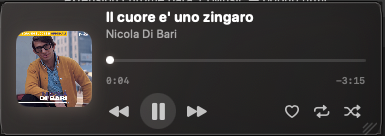
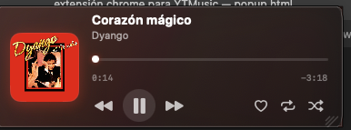
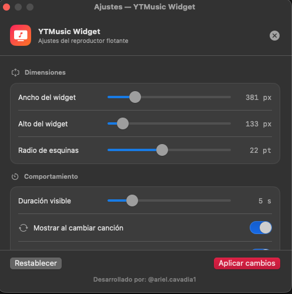
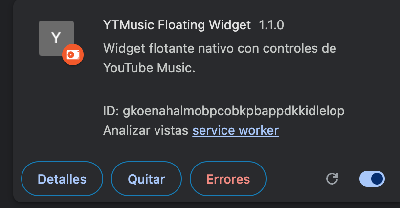

<div align="center">


# YTMusic Floating Widget

**A native macOS floating player for YouTube Music — always on top, always out of your way.**

[](LICENSE)
[](https://www.apple.com/macos/)
[](https://swift.org)
[](https://developer.chrome.com/docs/extensions/mv3/)

</div>

---

## ✨ What is this?

YTMusic Floating Widget is a **two-component system** that gives you a beautiful, always-on-top music controller for [YouTube Music](https://music.youtube.com) on macOS — without ever switching windows.

It sits in your menu bar as a small icon. When a song changes, it slides in, shows you what's playing, and quietly disappears after a few seconds. You can also pin it, resize it, seek through songs, and control everything from any app.

> Built for people who work with music on, and hate alt-tabbing just to skip a track.

---

## 🖼️ Screenshots

### Floating Widget — song playing


### Floating Widget — paused


### Settings Panel


### Chrome Extension card


---

## 🏗️ Architecture

```
┌─────────────────────────────────────────────────────────────┐
│                    YouTube Music (Chrome)                    │
│  ┌──────────────────────────────────────────────────────┐   │
│  │  content.js  — reads DOM + MediaSession API          │   │
│  │  • navigator.mediaSession.metadata (title, artist,   │   │
│  │    artwork) — same source macOS Now Playing uses      │   │
│  │  • video.currentTime / video.duration  (progress)    │   │
│  │  • DOM buttons (like, repeat, shuffle state)         │   │
│  └──────────────┬───────────────────────────────────────┘   │
│                 │  chrome.tabs.sendMessage (pull / push)     │
│  ┌──────────────▼───────────────────────────────────────┐   │
│  │  background.js (Service Worker)                       │   │
│  │  • Polls content script every 500 ms for state       │   │
│  │  • POSTs state → http://localhost:23567/state        │   │
│  │  • GETs  commands ← http://localhost:23567/command   │   │
│  │  • Forwards commands → content script → YT Music     │   │
│  └──────────────┬───────────────────────────────────────┘   │
└─────────────────│───────────────────────────────────────────┘
                  │  HTTP  (localhost:23567)
┌─────────────────▼───────────────────────────────────────────┐
│             YTMusicWidget  (Swift / macOS native app)        │
│                                                             │
│  LocalServer ──► PlayerStateModel ──► WidgetView (SwiftUI)  │
│       │                                      │              │
│  CommandQueue ◄── FloatingWindowController ◄─┘              │
│       │                                                     │
│  AppDelegate (NSStatusItem, Settings, Launch-at-Login)      │
└─────────────────────────────────────────────────────────────┘
```

### Component breakdown

| File | Responsibility |
|---|---|
| `AppDelegate.swift` | Menu bar icon, single-click show/hide, double-click settings, right-click menu |
| `FloatingWindowController.swift` | `NSPanel` always-on-top, auto-hide timer, hover detection, position calculation (9-grid), visual resize |
| `WidgetView.swift` | SwiftUI UI — album art, title, artist, interactive progress bar (seek), control buttons, resize handle |
| `LocalServer.swift` | Minimal HTTP server (`Network.framework`, no dependencies) on port 23567 |
| `PlayerState.swift` | `ObservableObject` shared between server and SwiftUI |
| `SettingsManager.swift` | `UserDefaults` persistence + `SMAppService` for Launch at Login |
| `SettingsView.swift` | Settings panel — position grid, size sliders, auto-launch toggle, hide timer |
| `content.js` | Reads YouTube Music state; handles seek via mouse-event simulation on the slider |
| `background.js` | Service Worker bridge — state pull, command dispatch, tab injection |
| `manifest.json` | Chrome Extension Manifest V3 |

---

## 📋 Requirements

| Requirement | Version |
|---|---|
| macOS | **14 Sonoma or later** |
| Xcode Command Line Tools | **Xcode 15 / Swift 5.9+** |
| Google Chrome | Any recent version |
| YouTube Music | Open in Chrome (music.youtube.com) |

---

## 🚀 Installation & Setup

### 1 — Clone the repository

```bash
git clone https://github.com/arielcavadia1/YTMusicWidget.git
cd YTMusicWidget
```

### 2 — Build & launch the native app

```bash
chmod +x run.sh
./run.sh
```

This compiles the Swift app in release mode and launches it. A 🎵 icon appears in your **menu bar**.

> **First run:** macOS may ask for permission to allow network connections on localhost. Click **Allow**.

You can also build manually:

```bash
cd floating-widget
swift build -c release
.build/release/YTMusicWidget
```

### 3 — Load the Chrome Extension

1. Open Chrome and navigate to `chrome://extensions`
2. Enable **Developer mode** (top-right toggle)
3. Click **"Load unpacked"**
4. Select the `chrome-extension/` folder inside the cloned repo
5. The red music-note icon appears in your Chrome toolbar

### 4 — Open YouTube Music

Navigate to [music.youtube.com](https://music.youtube.com) and play a song.  
The widget will appear automatically when the track starts.

---

## 🎛️ Usage

### Menu bar icon

| Action | Result |
|---|---|
| **Single click** | Show / hide the floating widget |
| **Double click** | Open Settings panel |
| **Right click** | Context menu (Show, Settings, Quit) |

### Floating widget

| Action | Result |
|---|---|
| **⏮ / ⏭** | Previous / Next track |
| **▶ / ⏸** | Play / Pause |
| **♥** | Like the current track |
| **🔁** | Toggle Repeat |
| **🔀** | Toggle Shuffle |
| **Click or drag** the progress bar | Seek to any position in the song |
| **Drag** the ◢ handle (bottom-right) | Resize widget width (height auto-adapts) |
| **Hover** over widget | Pauses the auto-hide timer |

### Auto-show on song change

When a track changes, the widget automatically slides in and then fades out after the configured duration. You can adjust this in **Settings → Hide after**.

---

## ⚙️ Settings

Open with **double-click on the menu bar icon**.

| Setting | Description |
|---|---|
| **Position** | 3×3 grid — place the widget in any corner or edge of the screen |
| **Widget width** | 280 – 800 px (height auto-adapts to content) |
| **Corner radius** | 8 – 40 pt |
| **Hide after** | Seconds before the widget auto-hides (1 – 30 s) |
| **Launch at Login** | Registers with macOS Login Items via `SMAppService` |

---

## 🔌 API Reference (HTTP — port 23567)

The native app exposes a minimal local HTTP server for the Chrome extension to communicate with.

### `GET /ping`
Health check. Returns `{"ok": true}` if the app is running.

### `POST /state`
The Chrome extension sends the current player state.

```json
{
  "title":       "Corazón Mágico",
  "artist":      "Dyango",
  "albumArt":    "https://...",
  "isPlaying":   true,
  "isLiked":     false,
  "repeatMode":  "NONE",
  "isShuffled":  false,
  "currentTime": 14.3,
  "duration":    212.0,
  "timeText":    "0:14",
  "totalText":   "3:32",
  "trackId":     "Corazón Mágico::Dyango"
}
```

### `GET /command`
The Chrome extension polls this endpoint every 700 ms.  
Returns pending commands and clears the queue.

```json
{ "commands": ["play_pause"] }
```

Supported commands: `play_pause`, `prev`, `next`, `like`, `repeat`, `shuffle`, `seek:0.7500`

---

## 🔐 Permissions

### Chrome Extension (`manifest.json`)

| Permission | Why |
|---|---|
| `tabs` | Query / message the YouTube Music tab |
| `scripting` | Inject `content.js` into already-open YT Music tabs |
| `storage` | Reserved for future sync features |
| `host_permissions: music.youtube.com/*` | Read DOM + MediaSession in the YT Music page |
| `host_permissions: localhost:23567/*` | Communicate with the native Swift app |

### macOS App

| Permission | Why |
|---|---|
| Localhost network | Serve the HTTP bridge on port 23567 |
| Login Items (`SMAppService`) | Optional — only when "Launch at Login" is enabled |

No outbound internet connections are made by the native app.

---

## 🏗️ Project Structure

```
YTMusicWidget/
├── chrome-extension/
│   ├── manifest.json        # Extension manifest (MV3)
│   ├── background.js        # Service Worker — bridge state ↔ commands
│   ├── content.js           # Injected in YouTube Music tab
│   ├── popup.html           # Toolbar popup — connection status
│   ├── icon16.png
│   ├── icon32.png
│   ├── icon48.png
│   └── icon128.png
│
├── floating-widget/
│   ├── Package.swift
│   └── Sources/YTMusicWidget/
│       ├── main.swift
│       ├── AppDelegate.swift
│       ├── FloatingWindowController.swift
│       ├── LocalServer.swift
│       ├── PlayerState.swift
│       ├── SettingsManager.swift
│       ├── SettingsView.swift
│       └── WidgetView.swift
│
├── run.sh                   # Build & launch script
├── LICENSE
└── README.md
```

---

## 🛠️ Development & Debugging

### Verify the native app is running

```bash
lsof -i :23567
curl http://localhost:23567/ping
# → {"ok":true}
```

### Kill a stale instance

```bash
lsof -ti:23567 | xargs kill -9
```

### Rebuild and relaunch

```bash
pkill -f YTMusicWidget; ./run.sh
```

### Chrome Extension logs

1. Go to `chrome://extensions`
2. Click **"Service Worker"** under YTMusic Widget → opens DevTools for `background.js`
3. Open DevTools on the YouTube Music tab for `content.js` logs

### Common issues

| Symptom | Fix |
|---|---|
| Widget shows "Sin reproducción" | 1. Is the native app running? Check `curl localhost:23567/ping`. 2. Reload the Chrome extension. 3. Reload the YouTube Music tab. |
| Buttons do nothing | Native app not running. Run `./run.sh`. |
| Port 23567 already in use | `lsof -ti:23567 \| xargs kill -9` then relaunch. |
| Extension not injecting | Go to `chrome://extensions`, reload the extension — it auto-injects into open YT Music tabs. |
| macOS blocks the app | System Settings → Privacy & Security → allow the app to accept network connections. |

---

## 🤝 Contributing

Pull requests are welcome! Some areas where contributions are appreciated:

- [ ] **Keyboard shortcuts** — global `MediaPlayPause`, `MediaNextTrack` via `NSEvent.addGlobalMonitorForEvents`
- [ ] **Last.fm scrobbling** — hook into the track-change event
- [ ] **Notification Center** — show a macOS notification on track change
- [ ] **Dark/Light album art** — better dominant-color extraction
- [ ] **Windows / Linux** — port the native bridge to another runtime

Please open an issue first to discuss what you'd like to change.

---

## 📬 Contact

Built by **Ariel Cavadia**  
Telegram: [@arielcavadia1](https://t.me/arielcavadia1)  
GitHub: [arielcavadia1](https://github.com/arielcavadia1)

---

## 📄 License

[MIT](LICENSE) © 2026 Ariel Cavadia
